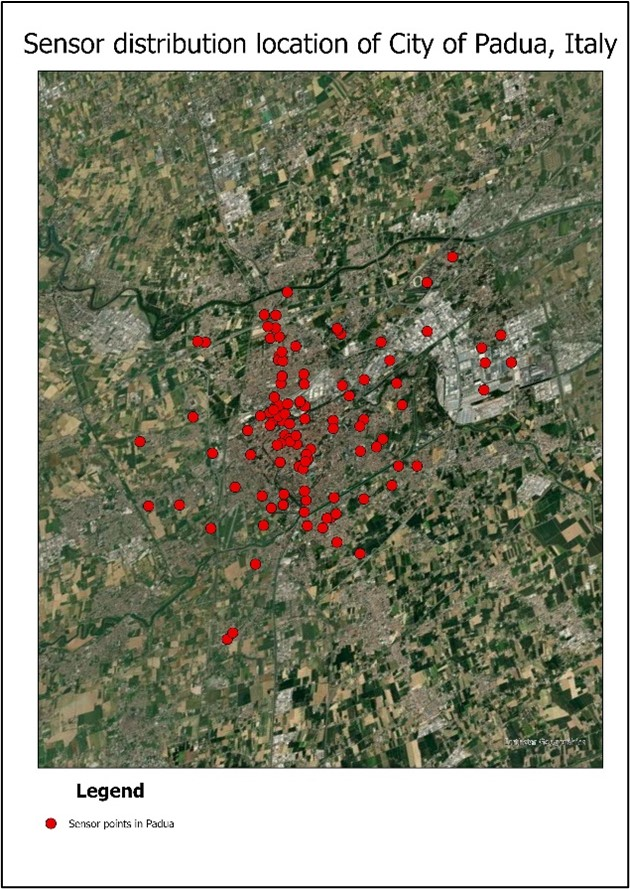

# Padua Sensor Location

Acknowledge the predicament of warming temperatures following frequent heatwaves in Padua, lead the Municipality of Padua (Comune di Padova) to install **109 sensors** with a height of **2m from the ground** distributed all over the city to record the temperature and humidity of the city (see Figure below). 

### [![Next]](../Survey-question/Survey-Intro.md)
 
 <!---------------------------------------------------------------------------->
 
 [Next]: https://img.shields.io/badge/Next-37a779?style=for-the-badge