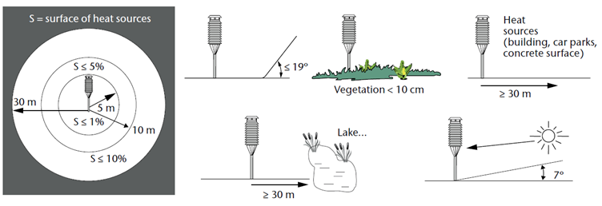

# Tracking the sensor site location 

To understand the exact UHI condition within the city, the data measurements with in-situ sensor monitoring, such as temperature and humidity, have to be gauged as the up-to-date basis for detecting the phenomenon and the attribution of its cause (IPCC, 2001). Pathak et al (2022) discussed that the temperature and humidity sensor placement has to be strategically arranged. However, finding a secure sensor sitting in urban areas can be challenging (Muller et al., 2013), especially with the occurrence of the equipment locations set, for instance, being in close range or no obstruction blocking. 

The World Meteorological Organization (WMO) created a standardized guideline for sensor sitting with the latest version was updated in 2021. The newest guidelines referred to detailed sitting and exposure of sensor placement described in Sitting and Exposure of Meteorological Instruments (WMO/TD-No.589). The author of the report mentioned four climatological criteria regarding the sensor installation site, which are: (i)  It should represent the region, (ii) no major obstacle like the cliff or deep ravine exists, (iii) consideration of available natural surroundings such soil and vegetation types, albedo, present-future built-up area, remoteness moisture source (lake, rivers), and (iv) absence of obstacles for the case of installation in cities, forest, and households area. However, though the sensor site  met all the requirements of recommended criteria at the time of installation, the landscape changes surrounding the site, such as the growth of vegetation and trees or new construction, is an unavoidable situation for the sensor to be exposed to such condition (WMO, 2021). To minimize such events, regular updates and inspections no less than every two years are needed to maintain the sensor sitting location. 

Within the updated version of the 2021 guidelines, WMO provided the class representatives to assess the environmental condition that influenced the sensor measurement. They characterize the existing site into five classes (high to low) regarding exposure rules and wide area representatives. Class one represents the ideal perfect site for sensor sitting, while class five is defined as a site that has nearby obstacles that are intended to represent the least tens of km2, also as the representative of the sensor placement, which does not fulfill the guidelines of the previous four classes (WMO, 2021).

Represented in Figures below, respectively, class one to four overview of the sitting environment for Air temperature and Humidity sensor. Each class provides the overview of how the sitting sensor should be located with respect to the angle position towards the ground and sun, as well as the surrounding landscape that possibly affects data recording. WMO (2021) stated that the main discrepancies that should be taken into consideration for air temperature and humidity sensor sitting are the shading effect from obstacles that affect incoming and unnatural surfaces.

>**Class one of sitting sensor guideline from WMO (Figure source: WMO, 2021)**

>**Class two of sitting sensor guideline from WMO (Figure source: WMO, 2021)**

 

>**Class three of sitting sensor guideline from WMO (Figure source: WMO, 2021)**

 

>**Class four of sitting sensor guideline from WMO (Figure source: WMO, 2021)**

### [![Next]](./Padua-Sensor-Location.md)
 
 <!---------------------------------------------------------------------------->
 
 [Next]: https://img.shields.io/badge/Next-37a779?style=for-the-badge